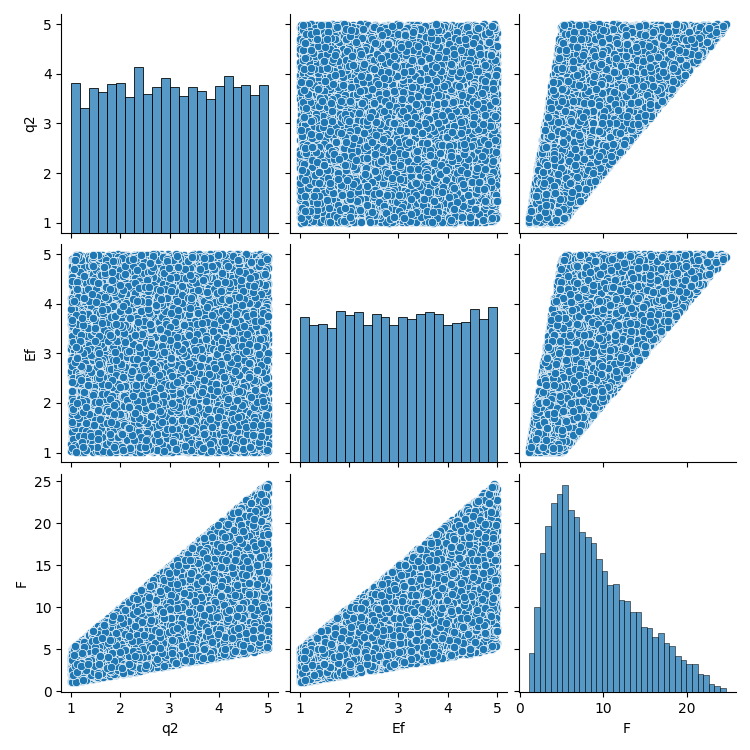
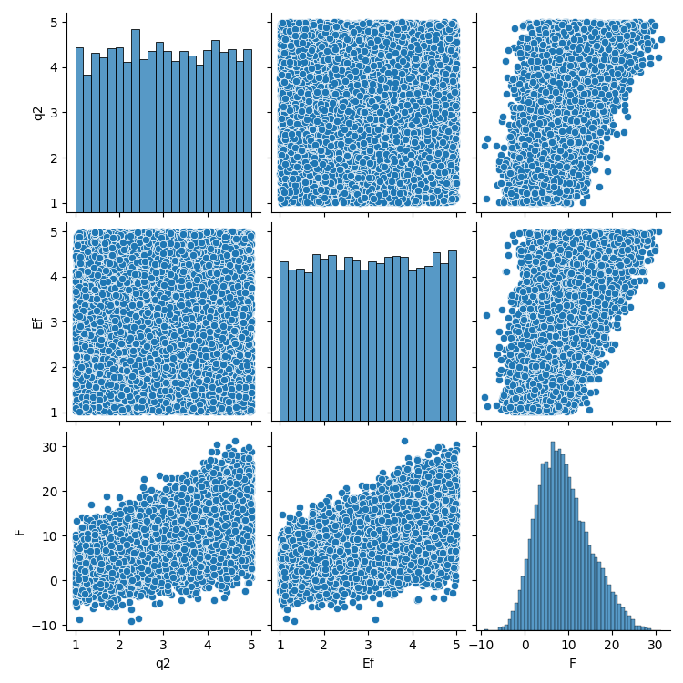
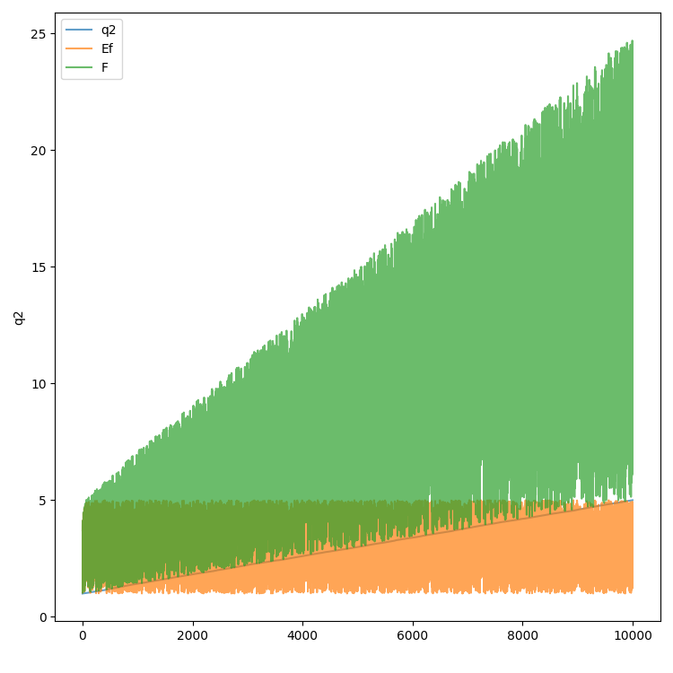
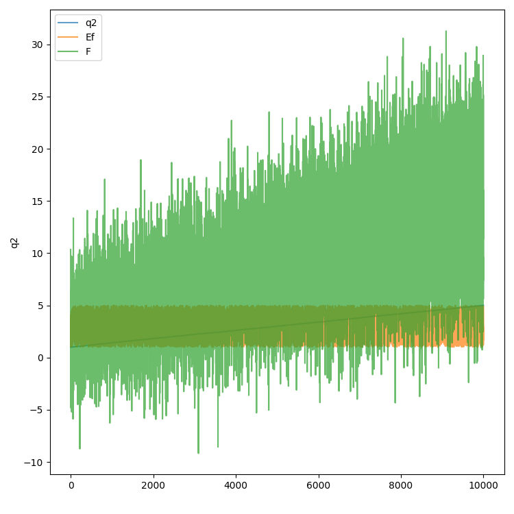
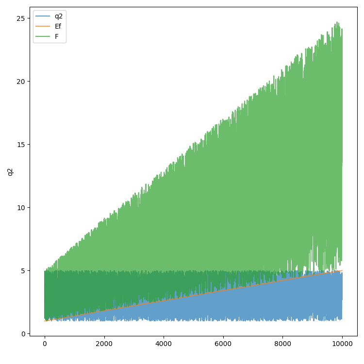
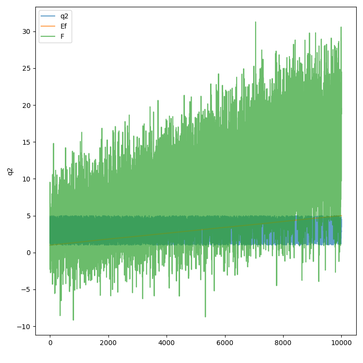

# Feynman equations - python
Provides a convenient way to use the Feynman equations in python code. 

## Generate datasets and utilize equations
```python
from Feynman.Functions import Feynman12 

inputSize = 10000

# (1) generate pandas datasets without noise

df = Feynman12.generate_df()

# (2) specify size of the uniform input range

df = Feynman12.generate_df(size = inputSize)

# (3) generate pandas datasets with noise
# pandas DataFrame ['q2','Ef','F']

df = Feynman12.generate_df(size = inputSize, noise_level=0.3)

# (4) generate datasets with noise and original target without noise
# pandas DataFrame ['q2','Ef','F','F_without_noise']

df = Feynman12.generate_df(size = inputSize, noise_level=0.3, include_original_target=True)

# (5) use the functions to calculate equations directly

inputSize = 10000
X = np.random.uniform([1.0,1.0], [5.0,5.0], (inputSize,2))
q2 = X[:,0] 
Ef = X[:,1] 
# f: q2*Ef
f1 = Feynman12.calculate(q2,Ef)

# (6) use the JSON representation
#     e.g. you want to iterate over all functions in code

# index one specific function
jsonArr = np.array(FunctionsJson)
json = jsonArr[[row['EquationName']== 'Feynman12' for row in FunctionsJson]][0]

# get executable python code
eq = eval(json['Formula_Lambda'])
f2 = [eq(row) for row in X]

# both produce same result
(f1==f2).all() #-> true

```

|without noise|with noise|
|:---:|:---:|
|pairplot without noise|pairplot with noise|
|||
|linechart without noise, sorted by [ 'Ef','q2', ]|linechart with noise, sorted by [ 'Ef','q2', ]|
|||
|linechart without noise, sorted by [ 'q2','Ef', ]|linechart with noise, sorted by [ 'q2','Ef', ]|
|||

## Information about function shapes in standard input space
Additional information about the function shape is provided by analyzing the value ranges of partial derivates of each Feynman function (whereever the partial derivatives can be symbolically calculated):

|Problem|Variable|Input Space|
|:---:|:---:|:---:|
|Feynman 12|q2| [1.0,5.0]|
|Feynman 12|Ef| [1.0,5.0]|

|Problem|Derived by|Order|Derivative|Monotonicity|
|:---:|:---:|:---:|:---:|:---:|
|Feynman 12|q2|1|Ef|increasing|
|Feynman 12|q2|2|0|constant|
|Feynman 12|Ef|1|q2|increasing|
|Feynman 12|Ef|2|0|constant|

The results of this analysis are provided in the file `Feynman/Constraints.py`.
Calculation of the shape properties is implemented in `create_files/sample_constraints.py`.

## Equation Sources
FeynmanEquations `generate/src/FeynmanEquations.csv` and `generate/src/BonusEquations.csv`
were retrieved on 01.04.2022 from https://space.mit.edu/home/tegmark/aifeynman.html. The
code in generate_functions.py parses these two files and generates the python code of
`Feynman/Functions.py`. 

## Changes from the original:
The following entries had mismatches between the specified number of variables and the
actual number of specified variables with their input ranges. A new download from the
original source might therefore not match the csv provided in this repository.

```
#1
from: II.37.1,83,E_n,mom*(1+chi)*B,6,mom,1,5,B,1,5,chi,1,5,,,,,,,,,,,,,,,,,,,,,
to:   II.37.1,83,E_n,mom*(1+chi)*B,3,mom,1,5,B,1,5,chi,1,5,,,,,,,,,,,,,,,,,,,,,

#2
from: I.18.12,22,tau,r*F*sin(theta),2,r,1,5,F,1,5,theta,0,5,,,,,,,,,,,,,,,,,,,,,
to:   I.18.12,22,tau,r*F*sin(theta),3,r,1,5,F,1,5,theta,0,5,,,,,,,,,,,,,,,,,,,,,

#3
from: I.18.14,23,L,m*r*v*sin(theta),3,m,1,5,r,1,5,v,1,5,theta,1,5,,,,,,,,,,,,,,,,,,
to:   I.18.14,23,L,m*r*v*sin(theta),4,m,1,5,r,1,5,v,1,5,theta,1,5,,,,,,,,,,,,,,,,,,

#4
from: I.38.12,39,r,4*pi*epsilon*(h/(2*pi))**2/(m*q**2),3,m,1,5,q,1,5,h,1,5,epsilon,1,5,,,,,,,,,,,,,,,,,,
to:   I.38.12,39,r,4*pi*epsilon*(h/(2*pi))**2/(m*q**2),4,m,1,5,q,1,5,h,1,5,epsilon,1,5,,,,,,,,,,,,,,,,,,

#5
from: III.10.19,91,E_n,mom*sqrt(Bx**2+By**2+Bz**2),3,mom,1,5,Bx,1,5,By,1,5,Bz,1,5,,,,,,,,,,,,,,,,,,
to:   III.10.19,91,E_n,mom*sqrt(Bx**2+By**2+Bz**2),4,mom,1,5,Bx,1,5,By,1,5,Bz,1,5,,,,,,,,,,,,,,,,,,

#6
from: III.19.51,99,E_n,-m*q**4/(2*(4*pi*epsilon)**2*(h/(2*pi))**2)*(1/n**2),4,m,1,5,q,1,5,h,1,5,n,1,5,epsilon,1,5,,,,,,,,,,,,,,,
to:   III.19.51,99,E_n,-m*q**4/(2*(4*pi*epsilon)**2*(h/(2*pi))**2)*(1/n**2),5,m,1,5,q,1,5,h,1,5,n,1,5,epsilon,1,5,,,,,,,,,,,,,,,

#7
from: test_12,12,2.11 Jackson,12,F,q/(4*pi*epsilon*y**2)*(4*pi*epsilon*Volt*d-q*d*y**3/(y**2-d**2)**2),4,q,1,5,y,1,3,Volt,1,5,d,4,6,epsilon,1,5,,,,,,,,,,,,,,,
to:   test_12,12,2.11 Jackson,12,F,q/(4*pi*epsilon*y**2)*(4*pi*epsilon*Volt*d-q*d*y**3/(y**2-d**2)**2),5,q,1,5,y,1,3,Volt,1,5,d,4,6,epsilon,1,5,,,,,,,,,,,,,,,

#8
from: test_13,13,3.45 Jackson,13,Volt,1/(4*pi*epsilon)*q/sqrt(r**2+d**2-2*r*d*cos(alpha)),4,q,1,5,r,1,3,d,4,6,alpha,0,6,epsilon,1,5,,,,,,,,,,,,,,,
to:   test_13,13,3.45 Jackson,13,Volt,1/(4*pi*epsilon)*q/sqrt(r**2+d**2-2*r*d*cos(alpha)),5,q,1,5,r,1,3,d,4,6,alpha,0,6,epsilon,1,5,,,,,,,,,,,,,,,

#9
test_18,18,15.2.1 Weinberg,18,rho_0,3/(8*pi*G)*(c**2*k_f/r**2+H_G**2),4,G,1,5,k_f,1,5,r,1,5,H_G,1,5,c,1,5,,,,,,,,,,,,,,,
test_18,18,15.2.1 Weinberg,18,rho_0,3/(8*pi*G)*(c**2*k_f/r**2+H_G**2),5,G,1,5,k_f,1,5,r,1,5,H_G,1,5,c,1,5,,,,,,,,,,,,,,,

#10
test_19,19,15.2.2 Weinberg,19,pr,-1/(8*pi*G)*(c**4*k_f/r**2+H_G**2*c**2*(1-2*alpha)),5,G,1,5,k_f,1,5,r,1,5,H_G,1,5,alpha,1,5,c,1,5,,,,,,,,,,,,
test_19,19,15.2.2 Weinberg,19,pr,-1/(8*pi*G)*(c**4*k_f/r**2+H_G**2*c**2*(1-2*alpha)),6,G,1,5,k_f,1,5,r,1,5,H_G,1,5,alpha,1,5,c,1,5,,,,,,,,,,,,
```